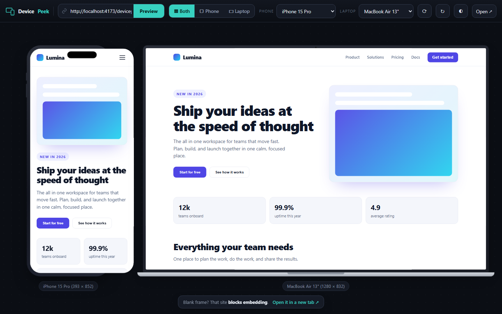

# DevicePeek

See any website or app as an iPhone and a laptop, side by side, right in your browser.

DevicePeek renders a URL at real device widths inside an iPhone frame and a laptop
frame at the same time. Paste your site, a Vercel or Netlify preview link, or
`localhost:3000`, and instantly see how the responsive layout behaves on each. It
gives you a fast feedback loop while you build an app or website.

Live app: https://fredler21.github.io/devicepeek/

## Screenshot

## Features

- iPhone and laptop, together, so you can spot responsive breakpoints at a glance
- Any URL, including your deploys, preview links, or `localhost` for live local dev
- Shareable preview links. Add `?url=example.com` to the address and DevicePeek opens with that site already loaded
- Device presets: iPhone 15 Pro, Pro Max, and SE, Pixel 8, Galaxy S23, plus MacBook Air, 1366, 1440, and 1024 laptops
- Rotate, reload, open in a new tab, and a light or dark backdrop toggle
- True responsive rendering. Each frame is a real iframe at that device's CSS width, so media queries fire exactly as they do on the device
- Built with TypeScript and Vite, so it stays typed and tiny

## Controls

- URL bar: type any address and press Preview or Enter. It adds `https` for you, and uses `http` for `localhost` and IP addresses
- Both, Phone, Laptop: choose which frames to show
- Phone and Laptop menus: pick a device preset
- Rotate: switch the phone between portrait and landscape
- Reload: refresh both frames at once
- Backdrop: toggle a light or dark stage behind the devices
- Open in a new tab: open the current URL directly, which is handy when a site blocks embedding

## Tech stack

- Language: TypeScript in strict mode
- Build tool: Vite
- Runtime dependencies: none. It is just DOM and CSS
- Hosting: GitHub Pages through GitHub Actions

## Getting started

    git clone https://github.com/Fredler21/devicepeek.git
    cd devicepeek
    npm install
    npm run dev

The dev server runs at http://localhost:5173/devicepeek/

Build and preview the production bundle:

    npm run build     # type checks with tsc, then bundles with Vite into dist
    npm run preview   # serve the built dist folder locally

## Preview your own project while building

Start your app's dev server, for example Next.js on port 3000:

    npm run dev

Then in DevicePeek, type localhost:3000 and press Preview.

## Project structure

    devicepeek/
      index.html                     Vite entry, markup only
      src/
        main.ts                      typed app logic for devices, layout, and scaling
        style.css                    styles
        vite-env.d.ts                Vite client types
      public/favicon.svg             copied to the build as is
      vite.config.ts                 base path for GitHub Pages
      .github/workflows/deploy.yml   build and deploy to Pages on every push to main

## Deployment

Every push to main triggers the Deploy to GitHub Pages workflow, which runs `npm ci`
and `npm run build`, then publishes the dist folder to Pages. There are no manual steps.

## How it works

1. An iframe gets its own viewport, so sizing it to 393px makes the embedded page
   render its mobile CSS. You get real responsive behavior instead of a zoom.
2. The phone and laptop frames are pure HTML and CSS drawn around each iframe.
3. Each frame is scaled with a CSS transform to fit your screen.

## Good to know

Browsers will not let a page be embedded if it sends an `X-Frame-Options` header or a
`Content-Security-Policy: frame-ancestors` header. DevicePeek works with sites that
allow embedding, such as your own apps, most preview deployments, and `localhost`. It
cannot embed locked down sites like Google, YouTube, or many banks. When a frame comes
up blank, use the Open in a new tab shortcut.

It renders with your desktop browser engine, so it is accurate for layout and
responsive breakpoints. It will not reproduce Safari quirks that happen only on iOS,
so a real device is still the final check for those.

## Contributing

Contributions are welcome. See CONTRIBUTING.md for how to set up the project and open
a pull request.

## License

MIT, by Fredler Gracia Pierre-Louis. See the LICENSE file.
