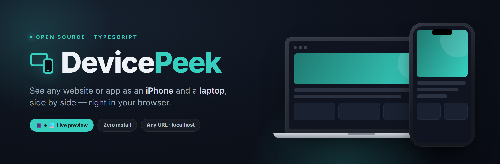

<p align="center">
  
</p>

<h1 align="center">DevicePeek</h1>

<p align="center">
  <b>See any website or app as an iPhone and a laptop, side by side — right in your browser.</b>
</p>

<p align="center">
  
  
  
  
</p>

---

DevicePeek renders a URL at real device widths inside an iPhone frame and a laptop
frame at the same time. Paste your site, a Vercel/Netlify preview link, or
`localhost:3000`, and instantly see how the responsive layout behaves on each — a fast
feedback loop while you're building an app or website.

**▶ Live app:** https://fredler21.github.io/devicepeek/

## Features

- 📱 **iPhone + 💻 laptop, together** — spot responsive breakpoints at a glance
- 🔗 **Any URL** — your deploys, preview links, or `localhost` for live local dev
- 🔄 **Device presets** — iPhone 15 Pro / Pro Max / SE, Pixel 8, Galaxy S23; MacBook Air, 1366, 1440, 1024
- ↻ **Rotate, reload, open-in-tab**, and a **light/dark backdrop** toggle
- 🎯 **True responsive rendering** — each frame is a real `<iframe>` at that device's CSS width, so `@media` queries fire exactly as on-device
- ⚡ **Built with TypeScript + Vite** — typed, tree-shaken, and tiny

## Tech stack

| | |
|---|---|
| Language | **TypeScript** (strict) |
| Build tool | **Vite** |
| Runtime deps | none — it's just DOM + CSS |
| Hosting | **GitHub Pages** via GitHub Actions |

## Getting started

```bash
git clone https://github.com/Fredler21/devicepeek.git
cd devicepeek
npm install
npm run dev       # http://localhost:5173/devicepeek/
```

Build & preview the production bundle:

```bash
npm run build     # type-checks with tsc, then bundles with Vite -> dist/
npm run preview   # serve the built dist/ locally
```

## Preview your own project while building

```bash
npm run dev       # start your app's dev server, e.g. Next.js on :3000
```

Then in DevicePeek, type `localhost:3000` and hit **Preview**.

## Project structure

```
devicepeek/
├─ index.html              # Vite entry (markup only)
├─ src/
│  ├─ main.ts              # typed app logic (devices, layout, scaling)
│  ├─ style.css            # styles
│  └─ vite-env.d.ts        # Vite client types
├─ public/favicon.svg      # copied to the build as-is
├─ vite.config.ts          # base path for GitHub Pages
└─ .github/workflows/deploy.yml   # build + deploy to Pages on every push to main
```

## Deployment

Every push to `main` triggers the **Deploy to GitHub Pages** workflow, which runs
`npm ci && npm run build` and publishes `dist/` to Pages — no manual steps.

## How it works

1. An `<iframe>` gets its **own viewport**, so sizing it to 393 px makes the embedded
   page render its *mobile* CSS — real responsive behavior, not a zoom.
2. The phone/laptop **frames are pure HTML/CSS** drawn around each iframe.
3. Each frame is **scaled with `transform: scale()`** to fit your screen.

## Good to know

Browsers won't let a page be embedded if it sends an `X-Frame-Options` or
`Content-Security-Policy: frame-ancestors` header. DevicePeek works with sites that
**allow embedding** — your own apps, most preview deployments, and `localhost` — but
**not** locked-down sites like Google, YouTube, or many banks. When a frame comes up
blank, use the **Open in a new tab ↗** shortcut.

It renders with your desktop browser engine, so it's accurate for **layout and
responsive breakpoints**, but won't reproduce iOS-Safari-only quirks — a real device
is still the final check for those.

## License

MIT © Fredler Gracia Pierre-Louis — see [LICENSE](LICENSE).
